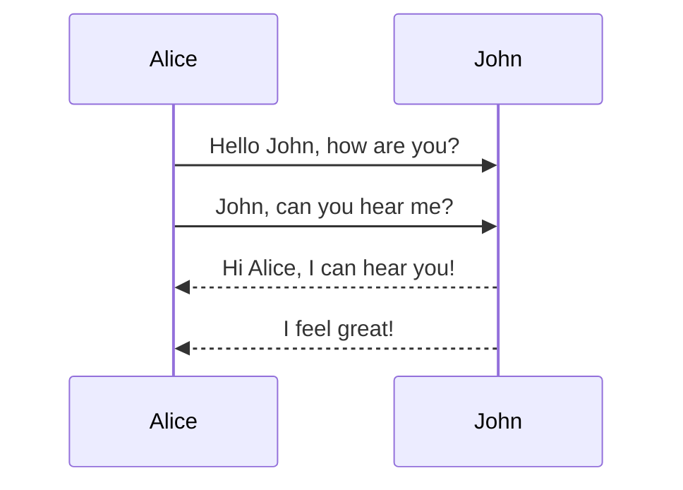
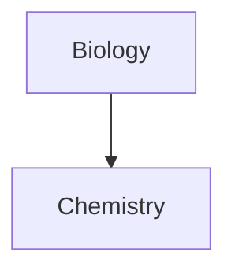

---
tags:
  - testing
  - experiments
  - nested/tag
  - nested/other_tag
Testing: true
created: 2023-09-25T18:34

---

[[index]]

$$
\begin{align*}
2+2&=4\\
1&=4-3
\end{align*}
$$

# Big Boi
## Medium Boi
### Smaller Boi
#### Oops, even smaller
##### Micro
###### Smallest
****
Hello
****
Put **bold** text inline but with *italics* and maybe _more italics_ and possibly ***Bold Italics*** then add a fraction $\frac{4}{7}$ inline too.

$\frac{4}{7}$

| First Name | Last Name |
|------------|-----------|
| Max        | Moir      |
***
Left-aligned text | Center-aligned text | Right-aligned text
:-- | :--: | --:
Content | Content | Content
***





> [!info]-
> Here's a [callout block](https://help.obsidian.md/Editing+and+formatting/Callouts).
> It supports **Markdown**, [[Internal link|Wikilinks]], and [[Embed files|embeds]]!

[[Computer Science/Modules/HCIN - COM00018C-A/Introduction Lecture#What is HCI?]]

```query
file:"Lecture 1"
```

![[DSC_0009.jpg|400]]


```js showLineNumbers{5}
import * as bcrypt from "bcrypt"

console.log("Hello World!")
```